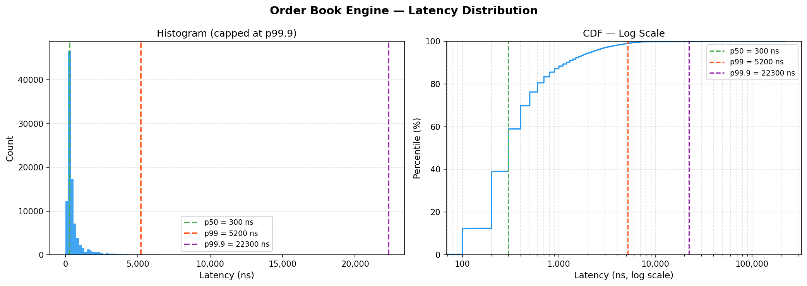
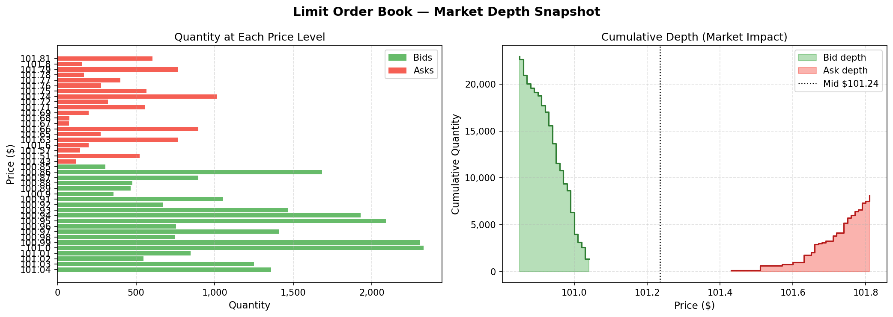

# Low-Latency Limit Order Book & Matching Engine

**Author:** Ravishek Kumar  

A high-performance C++20 Limit Order Book (LOB) and matching engine. This project focuses on ultra-low latency execution, efficient memory management, and realistic market simulation.

## Key Features

* **Matches Orders:** Executes trades using strict price-time priority.
* **Cancels Fast:** Achieves **O(1)** order cancellation using a hash-map iterator lookup.
* **Manages Memory:** Uses a C++17 `std::pmr::unsynchronized_pool_resource` (pool allocator) to eliminate dynamic heap allocation (`malloc`/`free`) on the hot path, preventing kernel syscall latency spikes.
* **Simulates Markets:** Generates realistic synthetic order flow using a Geometric Brownian Motion price model.
* **Visualizes Data:** Plots market depth and latency distributions using Python and Matplotlib.
* **Ensures Correctness:** Validated by 12 comprehensive unit tests using GoogleTest.

## Performance 

Benchmarks run on WSL2 (Ubuntu) using Google Benchmark. 

* **Median (p50) Latency:** ~300 ns
* **Tail (p99) Latency:** ~5,200 ns
* **Throughput:** 3,000,000+ operations per second

### Latency Distribution
The histogram below shows the massive spike near zero (O(1) pool allocator hits), while the CDF (log-scale) shows the latency tail percentiles.



### Market Depth
A snapshot of the Limit Order Book after simulating 100,000 orders. The right panel shows the cumulative market impact curve (liquidity available at each price level).



## Getting Started

### Prerequisites
* **C++ Compiler:** GCC 11+ or Clang 14+ (Must support C++20)
* **Build System:** CMake 3.20+
* **Python:** Python 3 (with `matplotlib`, `pandas`, `numpy` for visualizations)

### Build Instructions

Clone the repository and build using CMake in `Release` mode:

```bash
git clone https://github.com/yourusername/orderbook.git
cd orderbook
cmake -B build -DCMAKE_BUILD_TYPE=Release
cmake --build build -j$(nproc)
```

## Usage

After building, you will have four executables in the `build/` directory.

### 1. Run Unit Tests
Verifies price priority, time priority, partial fills, multi-level sweeps, and cancellations.
```bash
./build/tests
```

### 2. Run Micro-benchmarks
Measures the nanosecond latency of adding orders, cancelling orders, and matching trades.
```bash
./build/bench
```

### 3. Run the Market Simulator
Simulates 100,000 orders to generate realistic market data. Output is saved to the `results/` folder.
```bash
./build/sim
```

### 4. Generate Visualizations
Generate the charts shown above using the data created by the simulator.
```bash
pip install matplotlib pandas numpy
python3 scripts/plot_latency.py
python3 scripts/plot_book.py
```

## Architecture Details

* **`OrderBook`**: Uses `std::map` to sort bids (descending) and asks (ascending). 
* **`PriceLevel`**: A `std::pmr::list` representing a FIFO queue of orders at a specific price.
* **O(1) Cancellation**: The engine maintains a `std::unordered_map` that maps an `order_id` directly to its internal `list::iterator`. Cancelling an order simply erases the node via the iterator in O(1) time and returns the memory to the pool resource.

## Project Structure

* **`include/`**: Header files defining the core architecture (`Order.h`, `PriceLevel.h`, `OrderBook.h`, `MatchingEngine.h`).
* **`src/`**: Core implementation files processing trades and managing the order book (`OrderBook.cpp`, `MatchingEngine.cpp`).
* **`tests/`**: Unit testing suite using GoogleTest to ensure accuracy of the matching logic (`test_orderbook.cpp`).
* **`benchmarks/`**: Micro-benchmarking using Google Benchmark to measure engine latency (`bench_orderbook.cpp`).
* **`simulator/`**: Market simulation logic generating synthetic order flows (`MarketSimulator.h`, `MarketSimulator.cpp`, `sim_main.cpp`).
* **`scripts/`**: Python visualization scripts for charting results (`plot_book.py`, `plot_latency.py`).
* **`main.cpp`**: A simple interactive/demo driver to test basic trades.
* **`CMakeLists.txt`**: Build system configuration linking the project and its dependencies.
